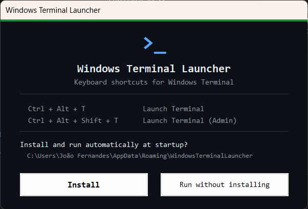

# >_ Windows Terminal Launcher



A lightweight AutoHotkey v2 utility that adds global keyboard shortcuts for launching Windows Terminal — with a clean dark-themed installer UI.

## Shortcuts

| Shortcut | Action |
|---|---|
| `Ctrl + Alt + T` | Launch Windows Terminal |
| `Ctrl + Alt + Shift + T` | Launch Windows Terminal as Administrator |

## Features

- **First-run installer** — on first launch, prompts you to install the app and register it as a startup program (no admin rights required)
- **Runs at startup** — registers itself under `HKCU\...\Run` so it starts silently with Windows
- **System tray** — lives in the tray, out of your way; right-click for options
- **Uninstaller built-in** — removes itself cleanly via the tray menu
- **Dark themed GUI** — custom dialogs styled to match Windows Terminal's aesthetic

## Requirements

- Windows 10 or 11
- [Windows Terminal](https://aka.ms/terminal) installed
- [AutoHotkey v2](https://www.autohotkey.com/) — only needed to run the `.ahk` source directly

## Usage

### Run from source
1. Install AutoHotkey v2
2. Double-click `WindowsTerminalLauncher.ahk`
3. Follow the install prompt

### Compile to `.exe` (no AHK required on target machine)
1. Right-click `WindowsTerminalLauncher.ahk` → **Compile Script**
   or run:
   ```
   Ahk2Exe.exe /in WindowsTerminalLauncher.ahk
   ```
2. Distribute and run `WindowsTerminalLauncher.exe` standalone

## Install location

When installed, the app copies itself to:
```
%AppData%\WindowsTerminalLauncher\WindowsTerminalLauncher.exe
```
and adds a registry entry at:
```
HKCU\Software\Microsoft\Windows\CurrentVersion\Run
```

## Uninstall

Right-click the system tray icon → **Uninstall & Exit**. This removes the registry entry and deletes the installed files automatically.

## Attribution

App icon — [Terminal](https://www.svgrepo.com/svg/448644/terminal) from the [Hashicorp Line Interface Icons](https://www.svgrepo.com/collection/hashicorp-line-interface-icons/) collection by [HashiCorp](https://www.hashicorp.com/), licensed under [MPL 2.0](https://www.mozilla.org/en-US/MPL/2.0/).

## Releases

Releases are published on GitHub with a compiled `.exe` attached so no AHK installation is needed.

Versioning follows [Semantic Versioning](https://semver.org/): `vMAJOR.MINOR.PATCH`

- `MAJOR` — breaking changes or full rewrites
- `MINOR` — new features
- `PATCH` — bug fixes

## License

This project is licensed under the [GNU General Public License v3.0](LICENSE).

You are free to use, modify, and distribute this software, but any derivative work must also be released under GPL v3 and remain open source.